# Design direction (v0.3, prototype v0.4)

_Status: proposal, waiting for the owner (Q11). Replaces v0.2, which the owner rejected on 2026-10-05 as generic. v0.1 colors in `DESIGN_SYSTEM.md` are also replaced if this is accepted._

## The rule we follow

Good product design comes from what the product does. GitHub looks like code review because people go there to review code. Nothing's dot-matrix comes from its hardware. So we don't start from a mood or a trend. We start from what Aetheris actually does all day:

1. It does a task in **steps**: reads files, runs tests, edits code, runs commands.
2. Every step goes through **one safety check**. Some steps it does on its own, some it has to ask you about, some it is never allowed to do.
3. Every change it makes to your computer **can be undone**.
4. It **only keeps an improvement to itself if a fixed set of practice tasks says it got better** and nothing broke.

The design shows those four things and nothing else.

## What that means on screen

| What Aetheris does | How the design shows it |
| --- | --- |
| Works in steps | The main view of a task is a list of steps with the time on the left, like a log. No chat bubbles. |
| Some steps only look, some change things | A **hollow circle** means it only looked (read a file, ran tests). A **filled square** means it changed something on your computer. You can tell at a glance what touched your files. |
| Some steps need you | An **orange square** and an inline box: the question in plain words, the exact command, what happens if you say yes, and whether it can be undone. Buttons say what they do ("Push", "Not now"), never "Approve". |
| Everything can be undone | Every change row has **Undo** right on it. The right side shows the exact change (diff) for the selected step. |
| It explains itself | Under each change: "Why this change" in one or two plain sentences. |
| It gets better, and proves it | "What it learned" shows practice tasks solved per week, and every change it tried with the result, including the ones it rejected and why. |
| It runs on free model limits | The title bar shows which model is in use and how many free requests are left today. |
| Which tool ran | The real tool name (`run_tests`, `edit_file`) is shown next to the step in small monospace text. Nothing is hidden. |

The logo is the same idea: a line with a circle (looked), a square (changed), and an orange square (asked you). It is the log in miniature.

## Visual rules

- **Color only means something.** Text is near-black on warm off-white (or the reverse in dark mode). Color is used for: orange = waiting for you, red = failed or blocked, green/red = added/removed lines. Nothing else is colored. No brand gradient, no glow.
- **Type:** IBM Plex Sans for words, IBM Plex Mono for anything the computer produced (times, paths, commands, counts, code). Free (OFL), made for technical interfaces, and readable at 12-13 px. On Windows we may switch the UI text to Segoe UI Variable after testing.
- **Density like a desktop tool:** 13 px base text, 34 px title bar, 248 px task list, thin 1 px lines instead of cards and shadows, 4-6 px corner radius.
- **Layout:** task list (left), the task's steps (middle), details of the selected step (right). Same on every screen, so nothing jumps around.
- **Motion:** only when something changes state (a step finishes, a question appears). No decorative animation.
- **Light and dark** are both first-class. Light is the default.

## Writing rules

The words matter as much as the visuals. The owner explicitly does not want AI-sounding wording.

- Say what happened, in plain words: "Ran the tests: 38 passed, 2 failed." Not "Execution complete."
- Aetheris speaks in first person only when it asks something: "Can I push this fix to GitHub?"
- No made-up names for features. "What it learned", "History", "Settings", "Waiting for you". Not "Insights", "Memory Core", "Trust Center".
- No hype words: seamless, powerful, intelligent, magic, supercharge, unlock, journey, delve.
- Numbers are exact and real. If it doesn't know, it says "unknown".

## What we will not do

- Purple-blue gradients, glassmorphism, glowing borders, sparkle icons, emoji in the UI.
- Dashboards full of big number cards that don't help you do anything.
- Chat-bubble layout for task work.
- Stock illustrations or 3D blobs.

## Mockups

Two screens, light and dark, 1280x800 (the owner's screen size). Sample data, not real results.

| Screen | Light | Dark |
| --- | --- | --- |
| A task, waiting for your OK | 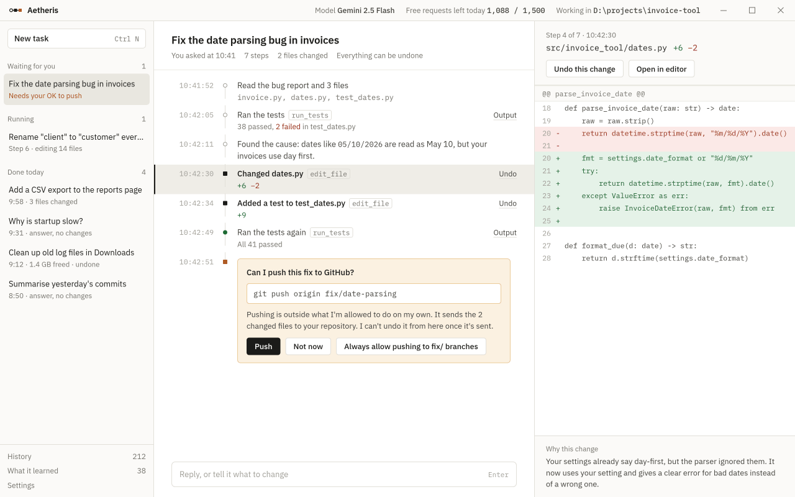 | 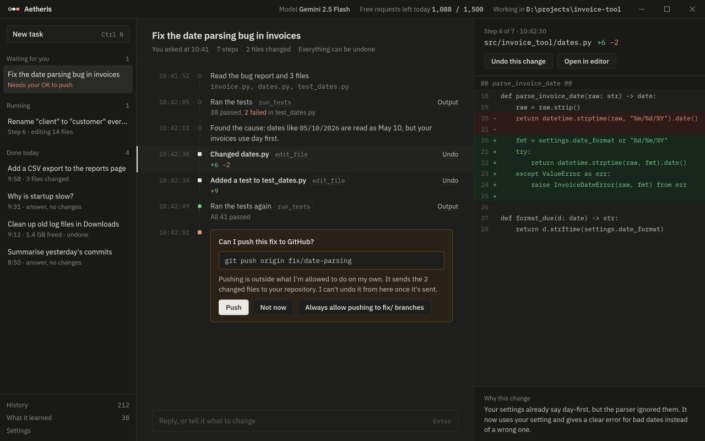 |
| What it learned | 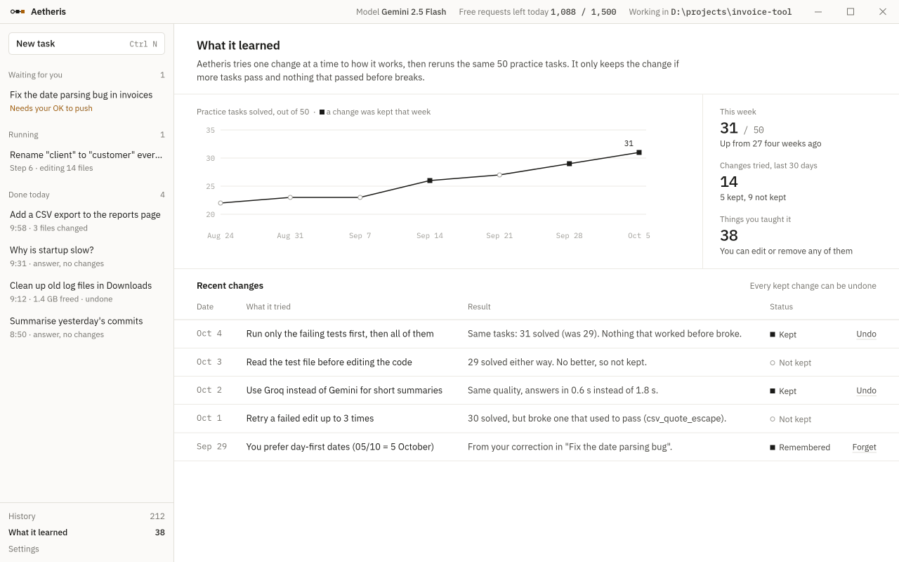 | 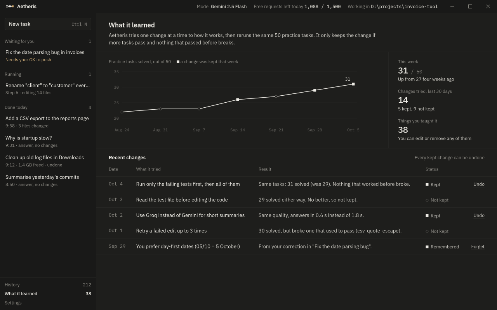 |

Source HTML: `mockups/v0.3/`. To re-render, see `mockups/README.md`.

## Prototype v0.4 (clickable)

The owner liked the v0.3 direction ("surely in the right direction") but asked for more: more interactive, a live view of what the AI is doing while it works (like Cursor or Claude show), and all the sections we planned. v0.4 is a clickable prototype that does that: `prototype/` (open `prototype/aetheris-prototype.html`).

What the live view shows, and why it fits this app:

| While it works | Why |
| --- | --- |
| **Thinking** notes in grey, typed out as it writes them | You see its reasoning in plain words before it acts |
| **Plan** pinned at the top: done (filled), now (pulsing), next (empty), and the step that will need you (orange) | You know what's coming and where it will stop to ask |
| The current step pulses and has a small progress bar; the time column is live | Clear what is happening right now |
| **Right side follows the live step**: test output streams line by line, the code change types in line by line | Same as watching over its shoulder, without a chat wall |
| "What this means" under every detail: "Running tests only reads your code. Nothing was changed." | Safety is explained, not just shown |
| Pause, Stop, and "add an instruction while it works" | You stay in control during the run, not only after |
| Undo / Redo on every change, also after it's done | Mistakes are cheap |

| Screen | |
| --- | --- |
| Task running (code change typing in) | 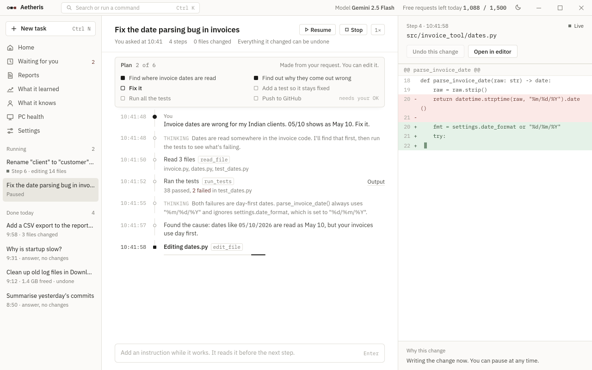 |
| Task waiting for your OK | 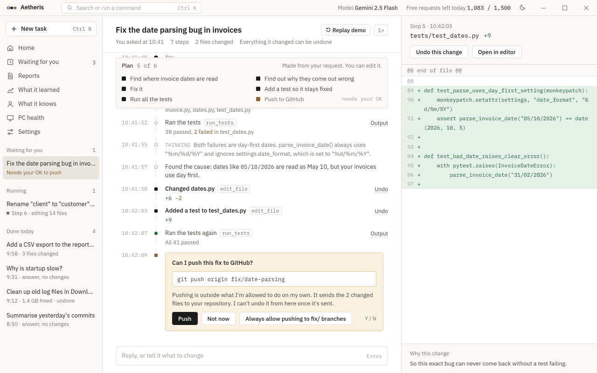 |
| Home | 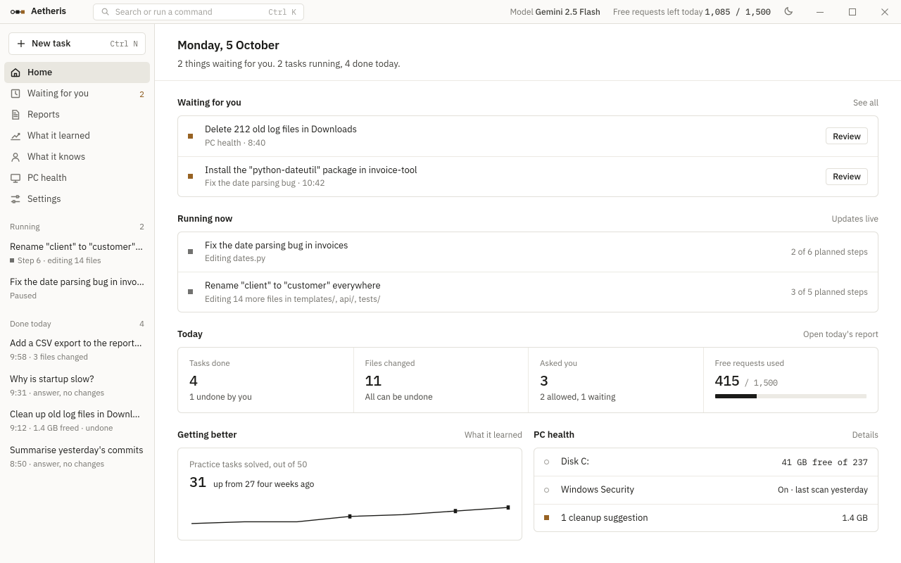 |
| Waiting for you | 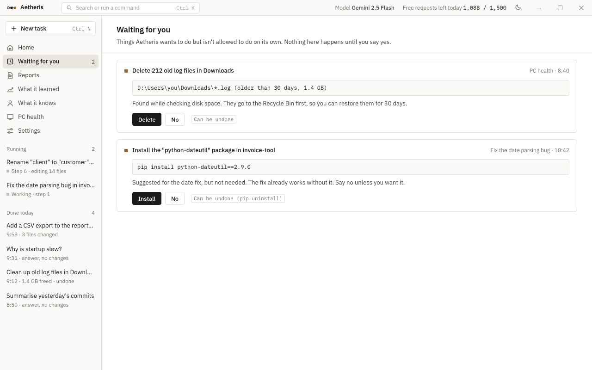 |
| Reports | 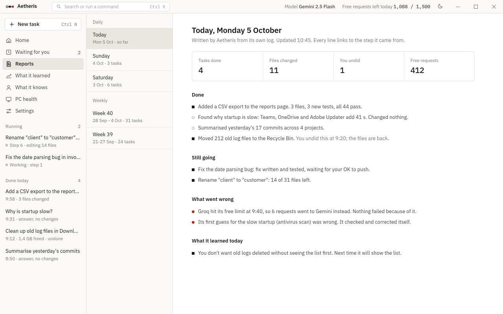 |
| What it learned | 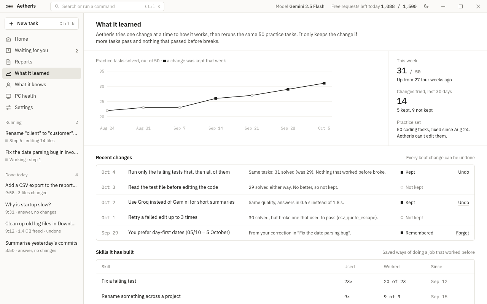 |
| What it knows | 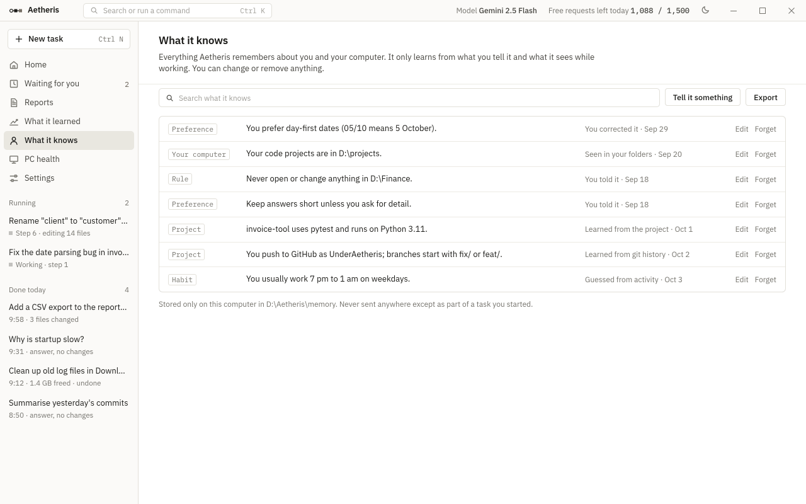 |
| PC health | 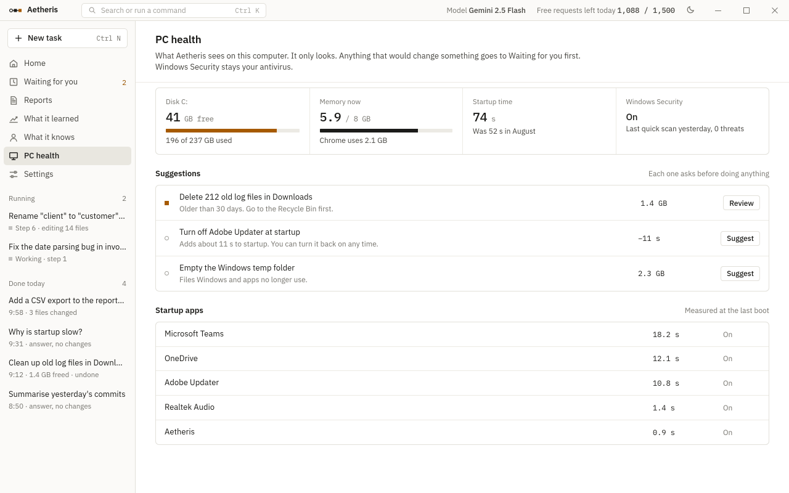 |
| Settings | 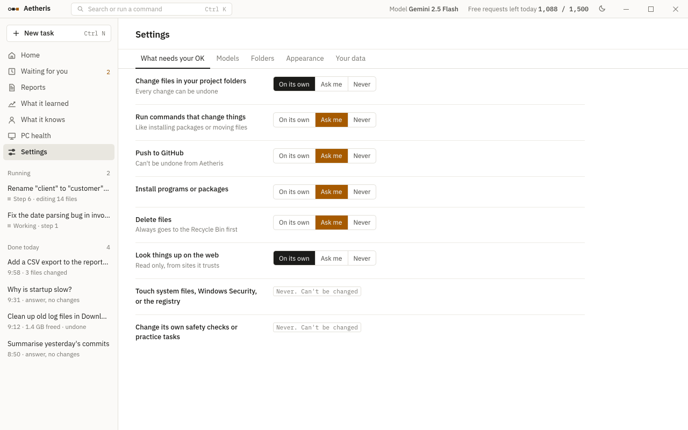 |

## Next if accepted

1. Turn the colors, type, and spacing above into `shell/src/styles/tokens.css`.
2. Build the step row, question box, diff view, and task list as real React components with tests.
3. Test on the owner's Windows laptop (font rendering, Segoe vs Plex, 125% scaling).
